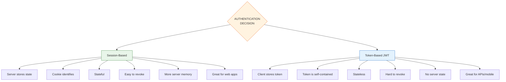

# 00 — Foundations

Before diving into any protocol or library, understand the core concepts that underpin every authentication system you'll build.

## AuthN vs AuthZ

| Concept | Question | Answers |
|---------|----------|---------|
| **Authentication (AuthN)** | "Who are you?" | Verifies identity via credentials |
| **Authorization (AuthZ)** | "What are you allowed to do?" | Grants or denies access to resources |

```
┌──────────────┐     ┌──────────────┐
│  AuthN       │     │  AuthZ       │
│  "Prove it"  │────>│  "Allowed"   │
└──────────────┘     └──────────────┘
    Login               Permission
    MFA                 Scope check
    Session             ACL / RBAC
```

```mermaid
flowchart LR
    A[AuthN<br/>"Prove it"] --> B[AuthZ<br/>"Allowed"]
    subgraph AuthN
        A1[Login<br/>MFA<br/>Session]
    end
    subgraph AuthZ
        A2[Permission<br/>Scope check<br/>ACL / RBAC]
    end
    style A fill:#e3f2fd,stroke:#1565c0
    style B fill:#fce4ec,stroke:#c62828
```

## Authentication Factors

```
 ┌──────────────────────────────────────────────────┐
 │              AUTHENTICATION FACTORS               │
 ├────────────┬──────────────┬──────────────────────┤
 │  Knowledge │  Possession  │     Inherence        │
 │  (you know)│  (you have)  │     (you are)        │
 ├────────────┼──────────────┼──────────────────────┤
 │ Password   │ Phone / TOTP │ Fingerprint          │
 │ PIN        │ Hardware Key │ Face ID              │
 │ Answer     │ Smart Card   │ Voice / Iris         │
 └────────────┴──────────────┴──────────────────────┘
```

## Core Entities

| Term | Definition |
|------|------------|
| **Identity** | A set of attributes that uniquely describe an entity |
| **Credential** | Evidence used to prove identity (password, key, token) |
| **Principal** | The entity being authenticated (user, service, device) |
| **Session** | A temporary, server-side record of an authenticated principal |
| **Token** | A self-contained or referenced credential for API access |

## Architectural Fork: Sessions vs Tokens



```
                 ┌─────────────────────────────┐
                 │  AUTHENTICATION DECISION     │
                 └─────────────┬───────────────┘
                               │
                 ┌─────────────┴───────────────┐
                 ▼                             ▼
   ┌────────────────────┐     ┌────────────────────────┐
   │  Session-Based     │     │  Token-Based (JWT/etc) │
   ├────────────────────┤     ├────────────────────────┤
   │ Server stores state│    │ Client stores token     │
   │ Cookie identifies  │    │ Token is self-contained │
   │ Stateful           │    │ Stateless              │
   │ Easy to revoke     │    │ Hard to revoke          │
   │ More server memory │    │ No server state         │
   │ Great for web apps │    │ Great for APIs/mobile   │
   └────────────────────┘     └────────────────────────┘
```

| Criterion | Sessions | Tokens |
|-----------|----------|--------|
| Revocation | Instant (delete session) | TTL or blocklist needed |
| Horiz. scaling | Shared store (Redis) needed | Stateless (verify anywhere) |
| Mobile | Cookie challenges | Works natively |
| Microservices | Gateway needed | Verify individually |
| Complexity | Lower | Higher |

## The STRIDE Threat Model

Every auth decision must consider threats:

| Threat | Example | Defense |
|--------|---------|---------|
| **S**poofing | Impersonating a user via stolen password | MFA, strong auth |
| **T**ampering | Modifying a JWT payload | Signatures (JWS) |
| **R**epudiation | User denies performing an action | Audit logging |
| **I**nformation Disclosure | Leaking tokens in logs | Never log tokens |
| **D**enial of Service | Flooding login endpoint | Rate limiting |
| **E**levation of Privilege | User escalates to admin | Authorization checks |

## Golden Rules

1. **Never trust the client** — validate everything server-side
2. **Defense in depth** — multiple layers of security
3. **Least privilege** — grant minimum access needed
4. **Fail secure** — auth failures deny, never allow
5. **Audit everything** — log all auth events
6. **Use standards** — don't roll your own crypto
7. **HTTPS always** — every auth mechanism requires TLS

## Next Steps

Once you understand these foundations, proceed to **01-basic-auth** and work through the topics sequentially. Each topic builds on the previous ones.

## Checkpoint

- [ ] Can you explain the difference between AuthN and AuthZ?
- [ ] Can you name the three authentication factors with examples?
- [ ] Can you describe when to use sessions vs tokens?
- [ ] Can you apply STRIDE to identify threats in an auth system?
