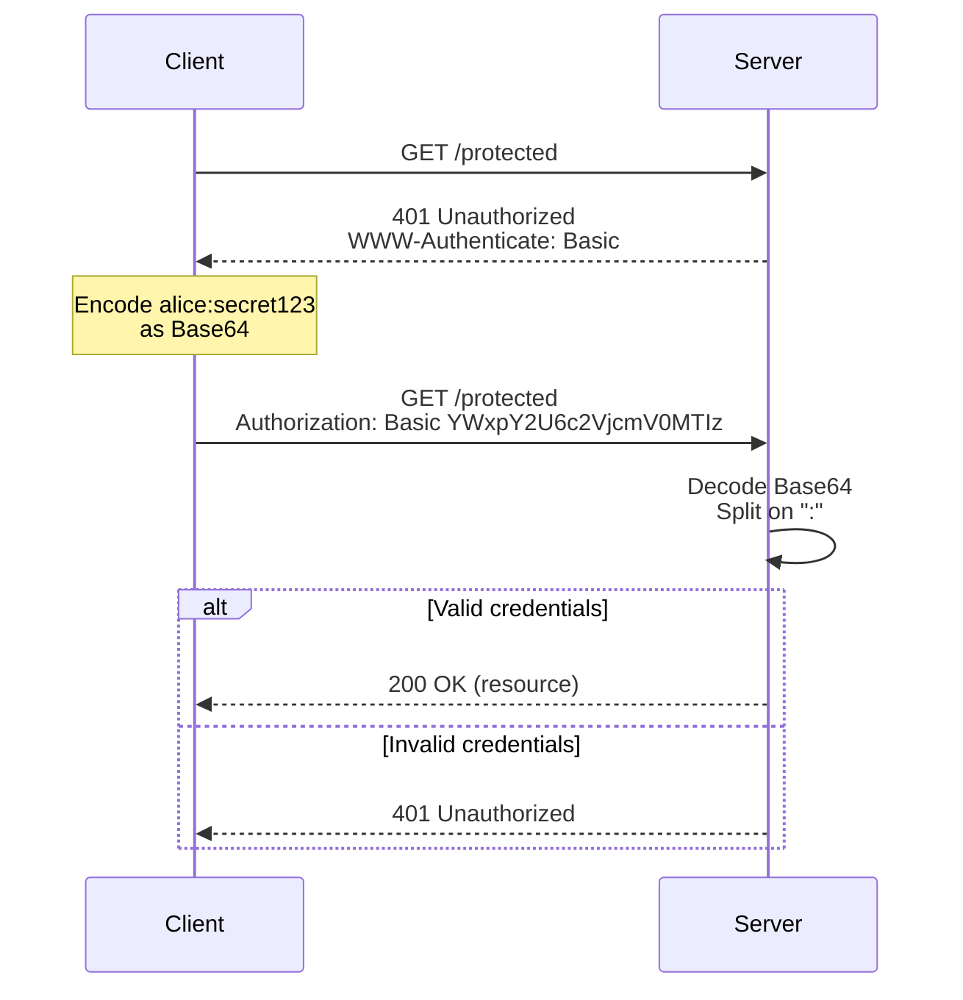

# 01 — HTTP Basic Authentication

HTTP Basic Auth is the simplest authentication mechanism defined in [RFC 7617](https://datatracker.ietf.org/doc/html/rfc7617). The client sends a username and password encoded as a Base64 string in the `Authorization` header.

## How It Works



```
Request:
  GET /protected-resource HTTP/1.1
  Authorization: Basic base64(username:password)

Server:
  1. Decode the Base64 value
  2. Split on ':' to get username and password
  3. Validate against credential store
  4. Return 200 ✅ or 401 ❌
```

### Wire Format

```
credentials = base64encode(username + ":" + password)
header     = "Basic " + credentials

Example:
  username: "alice"
  password: "secret123"
  raw:      "alice:secret123"
  b64:      "YWxpY2U6c2VjcmV0MTIz"
  header:   "Basic YWxpY2U6c2VjcmV0MTIz"
```

## Security Considerations

| Concern | Risk | Mitigation |
|---------|------|------------|
| Credentials in transit | **High** — Base64 is **not** encryption | **Must** use HTTPS/TLS |
| Credentials on client | **High** — browser caches, autofill | Session-based alternative preferred |
| Credential replay | **High** — sent on every request | Short credentials, IP binding, rate limiting |
| No logout mechanism | **Medium** — no session to invalidate | Combine with a session layer |
| CSRF | **Low** — browser native (not cookie-based) | Still apply CSRF defenses if mixed with cookies |

> **⚠️ Never use Basic Auth without HTTPS.** Base64 is trivially reversible. Any attacker on the network path can read credentials in plaintext.

## When to Use

| Use Case | Recommendation |
|----------|---------------|
| **Internal APIs** (service-to-service) | ✅ Acceptable with HTTPS + strong credentials |
| **Development / testing** | ✅ Convenient; disable in production |
| **Web browser forms** | ❌ Use session cookies + CSRF tokens |
| **Public-facing APIs** | ❌ Use Bearer tokens (JWT, opaque) or OAuth 2.0 |
| **CLI tools / scripts** | ✅ Common pattern — use with env vars, not hardcoded |

## Code Examples

| Language | Server | Client |
|----------|--------|--------|
| [Python](python/) | FastAPI middleware | httpx with auth |
| [TypeScript](typescript/) | Express middleware | fetch with encoding |
| [Go](go/) | net/http handler | net/http with auth |

## References

- [RFC 7617 — The 'Basic' HTTP Authentication Scheme](https://datatracker.ietf.org/doc/html/rfc7617)
- [RFC 7235 — HTTP/1.1 Authentication](https://datatracker.ietf.org/doc/html/rfc7235)
- [Mozilla MDN — Authorization header](https://developer.mozilla.org/en-US/docs/Web/HTTP/Headers/Authorization)
- [OWASP — Basic Auth](https://owasp.org/www-community/controls/Basic_Authentication)
