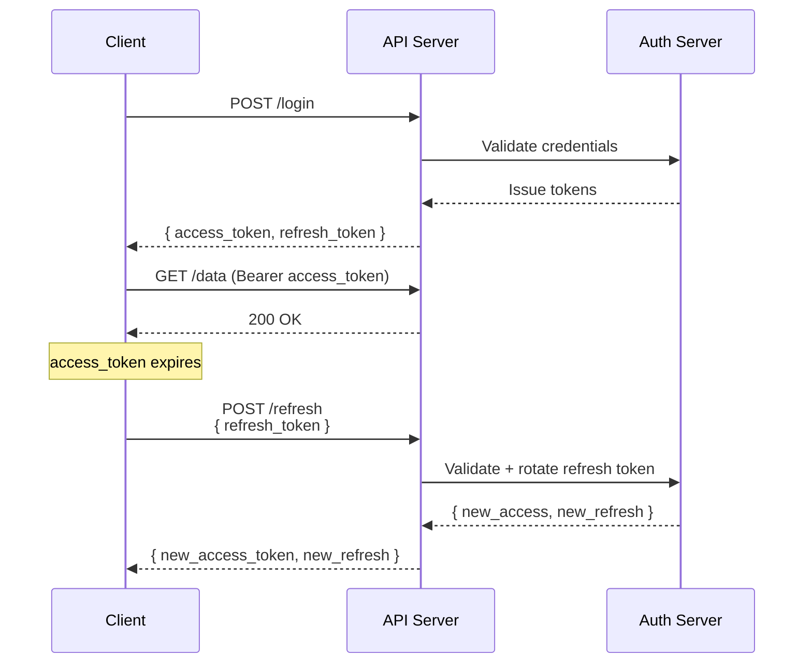

# 03 — JWT (JSON Web Tokens)

JWT is a compact, URL-safe token format for representing claims between parties defined in [RFC 7519](https://datatracker.ietf.org/doc/html/rfc7519). JWTs are **stateless** — the server doesn't need to store session data because the token itself carries the user information and is cryptographically verifiable.

```
header.payload.signature
```

## JWT Structure

```mermaid
graph LR
    subgraph JWT
        H[Header<br/>alg: HS256<br/>typ: JWT]
        P[Payload<br/>sub: user123<br/>role: admin<br/>iat: 1715000000<br/>exp: 1715000900]
        S[Signature<br/>HMACSHA256<br/>(base64(header).<br/>base64(payload),<br/>secret)]
    end
    H -.-> P -.-> S
    style H fill:#e1f5fe,stroke:#01579b
    style P fill:#fff3e0,stroke:#e65100
    style S fill:#e8f5e9,stroke:#1b5e20
```

Every JWT has three base64url-encoded segments separated by dots:

```
┌─────────────────────┐   ┌─────────────────────┐   ┌───────────────────────────┐
│       HEADER        │   │       PAYLOAD       │   │        SIGNATURE           │
│                     │   │                     │   │                           │
│ {                   │   │ {                   │   │ HMACSHA256(               │
│   "alg": "HS256",   │ . │   "sub": "user123", │ . │   base64url(header) + "." +│
│   "typ": "JWT"      │   │   "role": "admin",  │   │   base64url(payload),     │
│ }                   │   │   "iat": 1715000000,│   │   secret                  │
│                     │   │   "exp": 1715000900 │   │ )                         │
│                     │   │ }                   │   │                           │
└─────────────────────┘   └─────────────────────┘   └───────────────────────────┘
```

## Signing Algorithms

| Algorithm | Type | Key | Use Case |
|-----------|------|-----|----------|
| **HS256** | Symmetric | Single shared secret | Microservices on a trusted network, single-server apps |
| **HS384/512** | Symmetric | Single shared secret | Same, higher security margin |
| **RS256** | Asymmetric | RSA key pair (2048+ bit) | Distributed systems, third-party verification |
| **ES256** | Asymmetric | ECDSA P-256 | High security with smaller keys (mobile, IoT) |
| **EdDSA** | Asymmetric | Ed25519 | Modern, fast, compact |

### Symmetric vs Asymmetric

```
Symmetric (HS256):                         Asymmetric (RS256):
┌──────────┐          ┌──────────┐         ┌──────────┐          ┌──────────┐
│ SERVER A │          │ SERVER B │         │  AUTH    │          │  API     │
│          │          │          │         │  SERVER  │          │  SERVER  │
│ secret   │──────────│ secret   │         │  privkey │          │  pubkey  │
│ sign ✓   │  same!   │ verify ✓ │         │  sign ✓  │──────────│  verify ✓│
└──────────┘          └──────────┘         └──────────┘  public! └──────────┘
```

## Standard Claims (Registered Claim Names)

| Claim | Name | Required | Description |
|-------|------|----------|-------------|
| `iss` | Issuer | Recommended | Who created the token |
| `sub` | Subject | Recommended | Who the token is about (e.g. user ID) |
| `aud` | Audience | Recommended | Intended recipient (your client ID) |
| `exp` | Expiration | **Yes** | Unix timestamp when token expires |
| `nbf` | Not Before | No | Token not valid before this timestamp |
| `iat` | Issued At | Recommended | When token was issued |
| `jti` | JWT ID | No | Unique identifier (prevent replay) |

## Access Token vs Refresh Token

```
Login                   Access Token (15m)          Refresh Token (7d)
─────                   ──────────────────          ──────────────────
                        Short-lived proof           Long-lived credential
                        Sent on every API call      Used ONLY to get new access tokens
                        Stateless (no DB lookup)    Stored server-side (revocable)
                        Contains user claims        Opaque or JWT with `type: refresh`
```

### Token Refresh Flow



```
  Client                          API Server                    Auth Server
    |                                |                              |
    |── POST /login ────────────────>|                              |
    |<── { access_token, refresh } ──|                              |
    |                                |                              |
    |── GET /data (Bearer access) ──>|                              |
    |<── 200 OK ─────────────────────|                              |
    |                                |                              |
    |── (access_token expires) ──────|                              |
    |                                |                              |
    |── POST /refresh ───────────────|─────── validate refresh ────>|
    |   { refresh_token }            |                              |
    |<── { new_access, new_refresh }─|<──── rotate tokens ──────────|
```

## JWKS (JSON Web Key Set)

For asymmetric algorithms, the public keys used for verification are exposed via a JWKS endpoint:

```
GET /.well-known/jwks.json

{
  "keys": [{
    "kty": "RSA",
    "kid": "key-id-1",
    "use": "sig",
    "alg": "RS256",
    "n": "0vx7...base64url-encoded-modulus...",
    "e": "AQAB",
    ...
  }]
}
```

## Security Considerations

- **Never** put secrets in the payload — it's base64url-encoded, not encrypted. Anyone with the token can read it.
- **Always validate `exp`** — and check `iss`, `aud`, `nbf` for your application
- **Use asymmetric signing** (RS256/ES256) when multiple services verify tokens — only the issuer needs the private key
- **Short access token lifetime** (5-15 minutes). Pair with refresh tokens.
- **Implement refresh token rotation** — issue a new refresh token on each use; invalidate the old one
- **Use a blocklist** if you need to revoke individual tokens before expiry (but this breaks statelessness — use a database or Redis)
- **Guard against `alg=none` attack** — reject tokens with `"alg": "none"`
- **Guard against key confusion** — always validate the algorithm matches what you expect

## Common Attacks

| Attack | Description | Prevention |
|--------|-------------|------------|
| `alg=none` | Attacker sets `alg: "none"`, bypasses verification | Reject `alg: none` |
| Key confusion | Attacker tricks RS256 verifier into using HS256 with public key as secret | Always validate `alg` against expected value |
| Token sidejacking | Attacker steals token from localStorage/header | Short TTL, refresh rotation, secure storage |
| JWKS injection | Attacker provides their own JWKS | Pin JWKS URI, validate `kid` matches |

## Code Examples

| Language | Server | Features |
|----------|--------|----------|
| [Python](python/) | FastAPI + PyJWT | HS256 + RS256, access/refresh, JWKS |
| [TypeScript](typescript/) | Node.js + jose | HS256 + RS256, access/refresh, JWKS |
| [Go](go/) | net/http + golang-jwt | HS256 + RS256, access/refresh, JWKS |

## References

- [RFC 7519 — JSON Web Token](https://datatracker.ietf.org/doc/html/rfc7519)
- [RFC 7515 — JSON Web Signature (JWS)](https://datatracker.ietf.org/doc/html/rfc7515)
- [RFC 7517 — JSON Web Key (JWK)](https://datatracker.ietf.org/doc/html/rfc7517)
- [jwt.io — Online JWT Debugger](https://jwt.io)
- [OWASP JWT Cheat Sheet](https://cheatsheetseries.owasp.org/cheatsheets/JSON_Web_Token_for_Java_Cheat_Sheet.html)
- [Auth0 — JWT Handbook](https://auth0.com/resources/ebooks/jwt-handbook)
