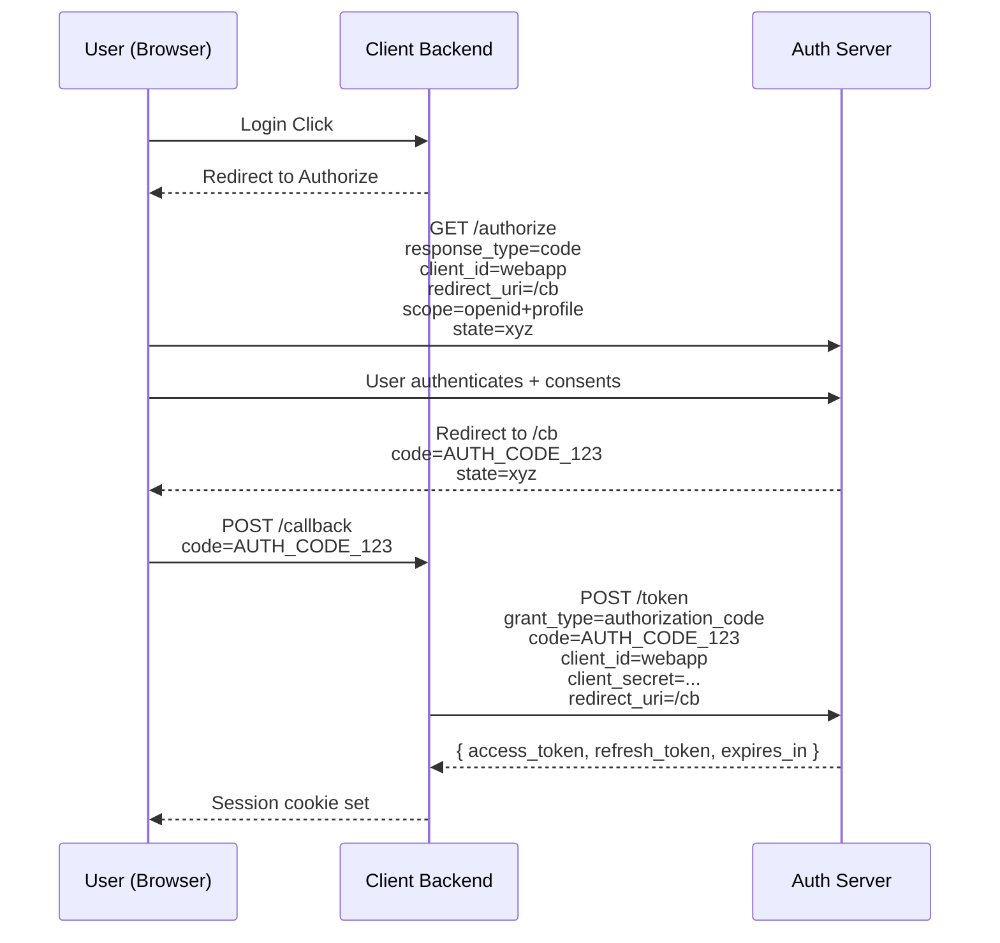
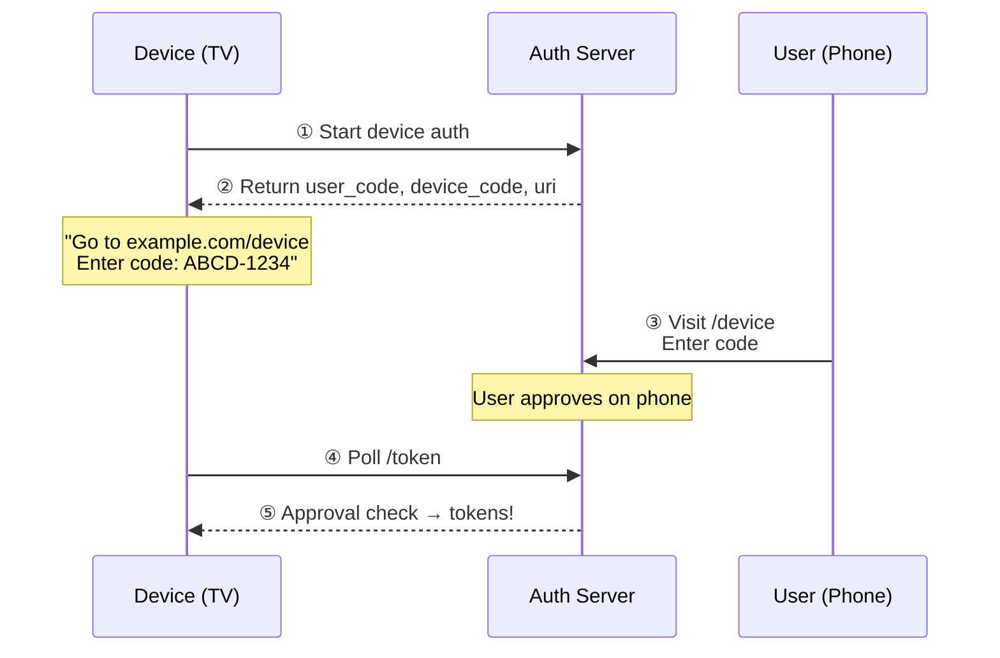

# 04 — OAuth 2.0

OAuth 2.0 is the industry-standard protocol for **authorization** ([RFC 6749](https://datatracker.ietf.org/doc/html/rfc6749)). It enables third-party applications to obtain limited access to a user's resources without ever seeing the user's password.

## Actors

```
┌──────────────┐     ┌─────────────────┐     ┌──────────────┐
│  Resource    │     │   Client App    │     │  Resource    │
│  Owner (RO)  │     │   (Web/Mobile)  │     │  Server (RS) │
│  (User)      │     │                 │     │  (API)       │
└──────┬───────┘     └────────┬────────┘     └──────┬───────┘
       │                      │                      │
       │              ┌───────┴────────┐             │
       │              │  Authorization │             │
       │              │  Server (AS)   │             │
       │              └────────────────┘             │
       └──────────────────────────────────────────────┘
```

## Grant Types

### 1. Authorization Code Grant (Web Apps)

The gold standard for server-side web applications.



```
User (Browser)          Client Backend          Auth Server
     │                        │                     │
     │  Login Click           │                     │
     │───────────────────────>│                     │
     │                        │                     │
     │  Redirect to Authorize │                     │
     │<───────────────────────│                     │
     │                        │                     │
     │  GET /authorize?       │                     │
     │  response_type=code    │                     │
     │  client_id=webapp      │                     │
     │  redirect_uri=/cb      │                     │
     │  scope=openid+profile  │                     │
     │  state=xyz             │                     │
     │─────────────────────────────────────────────>│
     │                        │                     │
     │  User authenticates +  │                     │
     │  consents              │                     │
     │─────────────────────────────────────────────>│
     │                        │                     │
     │  Redirect to /cb?      │                     │
     │  code=AUTH_CODE_123    │                     │
     │  state=xyz             │                     │
     │<─────────────────────────────────────────────│
     │                        │                     │
     │  POST /callback        │                     │
     │  code=AUTH_CODE_123    │                     │
     │───────────────────────>│                     │
     │                        │                     │
     │                        │  POST /token        │
     │                        │  grant_type=authorization_code
     │                        │  code=AUTH_CODE_123 │
     │                        │  client_id=webapp   │
     │                        │  client_secret=...  │
     │                        │  redirect_uri=/cb   │
     │                        │────────────────────>│
     │                        │                     │
     │                        │  { access_token,    │
     │                        │    refresh_token,   │
     │                        │    expires_in }     │
     │                        │<────────────────────│
     │                        │                     │
     │  Session cookie set    │                     │
     │<───────────────────────│                     │
```

### 2. Authorization Code + PKCE (SPAs / Mobile)

PKCE (Proof Key for Code Exchange, [RFC 7636](https://datatracker.ietf.org/doc/html/rfc7636)) prevents the authorization code interception attack. **Required** for all public clients.

```
┌─────────────────────────────────────────────────────────────────┐
│                         PKCE FLOW                                │
│                                                                  │
│  Client generates:                                               │
│    code_verifier  = random(32 bytes) → base64url                 │
│    code_challenge = base64url(sha256(code_verifier))              │
│                                                                  │
│  Authorize request includes:                                     │
│    code_challenge=<challenge>&code_challenge_method=S256         │
│                                                                  │
│  Token request includes:                                         │
│    code_verifier=<verifier>                                      │
│                                                                  │
│  Auth Server verifies:                                           │
│    base64url(sha256(verifier)) == challenge                      │
└─────────────────────────────────────────────────────────────────┘
```

### 3. Client Credentials Grant (Machine-to-Machine)

No user involved — the application authenticates itself.

```
┌──────────┐                        ┌──────────────┐
│  Service  │  POST /token          │  Auth        │
│  A        │  grant_type=client_credentials
│  (Client) │  client_id=svc-a      │  Server      │
│           │  client_secret=...    │              │
│           │──────────────────────>│              │
│           │                       │              │
│           │  { access_token }     │              │
│           │<──────────────────────│              │
└──────────┘                        └──────────────┘
```

### 4. Device Code Grant (TV / CLI / IoT)

For devices with limited input capabilities.



```
┌──────────┐        ┌──────────────┐        ┌──────────┐
│  Device   │        │  Auth        │        │  User    │
│  (TV)     │        │  Server      │        │  Phone   │
│           │        │              │        │          │
│  ① Start  │        │              │        │          │
│  device    │───────>│  ② Return    │        │          │
│  auth      │        │  user_code   │        │          │
│           │<───────│  device_code │        │          │
│           │        │  uri         │        │          │
│           │        │              │        │          │
│  "Go to    │        │              │  ③ Visit      │
│  example   │        │              │  /device      │
│  .com/     │        │              │─────── │
│  device"   │        │              │  Enter code   │
│           │        │              │<───────│       │
│           │        │              │        │          │
│  ④ Poll   │        │  ⑤ Approval  │        │          │
│  /token    │───────>│  check       │        │          │
│           │<───────│  tokens!     │        │          │
└──────────┘        └──────────────┘        └──────────┘
```

## OAuth 2.1 Changes

| Change | OAuth 2.0 | OAuth 2.1 |
|--------|-----------|-----------|
| PKCE | Optional for public clients | **Required** for all public clients |
| Implicit Grant | Available | **Removed** |
| Password Grant | Available | **Removed** |
| Refresh Token Rotation | Optional | **Recommended** |
| Bearer in URL | Allowed | **Prohibited** |

## Scopes

Scopes limit what the access token can do:

```
scope=read:users write:posts
```

Common patterns: `resource:action`, `api:v1:read`, `repo:user:email:read`

## Security Considerations

- **Always** validate `redirect_uri` against a strict whitelist
- **Always** use `state` parameter to prevent CSRF on auth code flow
- **PKCE** for all public clients (SPAs, mobile apps)
- **Short-lived** access tokens (5-15 min), longer-lived refresh tokens
- **Refresh token rotation** — new refresh token on each use
- **Validate client_id + client_secret** for confidential clients
- **HTTPS required** on all endpoints

## Code Examples

| Language | Auth Server | Client |
|----------|-------------|--------|
| [Python](python/) | FastAPI | httpx (all 4 grant types) |
| [TypeScript](typescript/) | Node.js HTTP | fetch (all 4 grant types) |
| [Go](go/) | net/http | net/http (all 4 grant types) |

## References

- [RFC 6749 — OAuth 2.0 Authorization Framework](https://datatracker.ietf.org/doc/html/rfc6749)
- [RFC 6750 — Bearer Token Usage](https://datatracker.ietf.org/doc/html/rfc6750)
- [RFC 7636 — PKCE](https://datatracker.ietf.org/doc/html/rfc7636)
- [RFC 8628 — Device Authorization Grant](https://datatracker.ietf.org/doc/html/rfc8628)
- [OAuth 2.1 (draft)](https://datatracker.ietf.org/doc/html/draft-ietf-oauth-v2-1)
- [OAuth 2.0 Security BCP (RFC 9700)](https://datatracker.ietf.org/doc/html/rfc9700)
- [Auth0 — OAuth 2.0 Overview](https://auth0.com/docs/protocols/oauth2)
