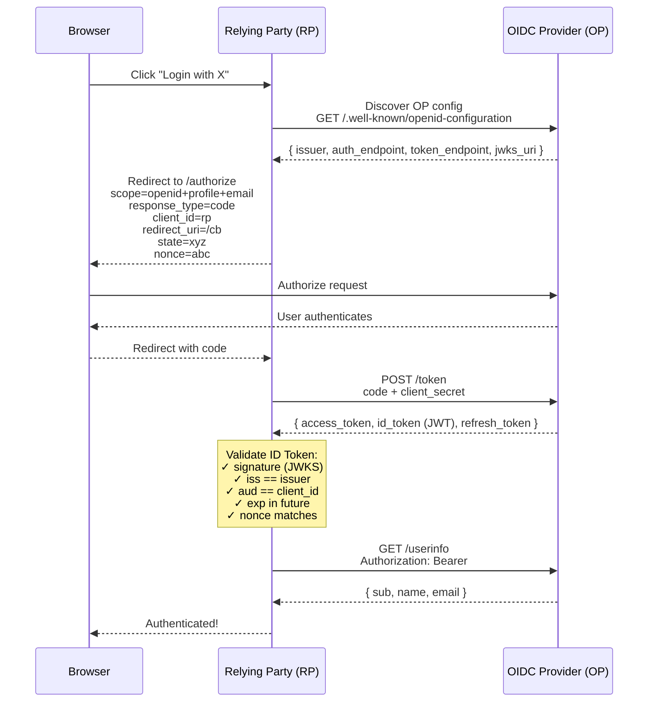

# 05 — OpenID Connect (OIDC)

OpenID Connect is an **identity layer** built on top of OAuth 2.0 ([spec](https://openid.net/specs/openid-connect-core-1_0.html)). Where OAuth 2.0 handles **authorization** (what you can access), OIDC adds **authentication** (who you are).

## Core Concepts

### ID Token

The ID Token is a JWT that contains identity claims about the user. This is the key addition over OAuth 2.0:

```json
{
  "iss": "https://accounts.example.com",
  "sub": "1234567890",
  "aud": "my-client-id",
  "exp": 1718000000,
  "iat": 1717996400,
  "auth_time": 1717996400,
  "nonce": "n-0S6_WzA2Mj",
  "acr": "urn:mace:incommon:iap:silver",
  "amr": ["pwd"],
  "azp": "my-client-id",
  "name": "Jane Doe",
  "email": "jane@example.com",
  "email_verified": true
}
```

### Standard Scope → Claims Mapping

| Scope | Claims returned |
|-------|-----------------|
| `openid` | `sub` (required) |
| `profile` | `name`, `given_name`, `family_name`, `picture`, `updated_at` |
| `email` | `email`, `email_verified` |
| `address` | `address` (JSON object) |
| `phone` | `phone_number`, `phone_number_verified` |

### OIDC Flow (Authorization Code + ID Token)



```
Browser                   Relying Party (RP)          OIDC Provider (OP)
  │                              │                          │
  │  Click "Login with X"        │                          │
  │─────────────────────────────>│                          │
  │                              │                          │
  │  Discover OP config          │                          │
  │  GET /.well-known/           │                          │
  │  openid-configuration        │                          │
  │────────────────────────────────────────────────────────>│
  │                              │                          │
  │  Redirect to /authorize      │                          │
  │  scope=openid+profile+email  │                          │
  │  response_type=code          │                          │
  │  client_id=rp                │                          │
  │  redirect_uri=/cb            │                          │
  │  state=xyz                   │                          │
  │  nonce=abc                   │                          │
  │<─────────────────────────────│                          │
  │                              │                          │
  │────────────────────────────────────────────────────────>│
  │                              │                          │
  │  User authenticates          │                          │
  │<────────────────────────────────────────────────────────│
  │                              │                          │
  │  Redirect with code          │                          │
  │─────────────────────────────>│                          │
  │                              │                          │
  │                              │  POST /token             │
  │                              │  code + client_secret    │
  │                              │─────────────────────────>│
  │                              │                          │
  │                              │  { access_token,         │
  │                              │    id_token (JWT),       │
  │                              │    refresh_token }       │
  │                              │<─────────────────────────│
  │                              │                          │
  │                              │  Validate ID Token:      │
  │                              │   ✓ signature (JWKS)     │
  │                              │   ✓ iss == issuer        │
  │                              │   ✓ aud == client_id     │
  │                              │   ✓ exp in future        │
  │                              │   ✓ nonce matches        │
  │                              │                          │
  │                              │  GET /userinfo           │
  │                              │  Authorization: Bearer   │
  │                              │─────────────────────────>│
  │                              │                          │
  │                              │  { sub, name, email }    │
  │                              │<─────────────────────────│
  │                              │                          │
  │  Authenticated!              │                          │
  │<─────────────────────────────│                          │
```

### ID Token Validation (Required Steps)

| Step | Why |
|------|-----|
| 1. Verify JWT signature | Using OP's JWKS endpoint — trust |
| 2. `iss` matches expected issuer | You're talking to the right OP |
| 3. `aud` contains your `client_id` | Token was meant for you |
| 4. `exp` is in the future | Token not stale |
| 5. `iat` is reasonable | Reject tokens issued far in the past/future |
| 6. `nonce` matches request | Replay attack prevention |
| 7. `azp` (if present) == `client_id` | Authorized party is you |

## Code Examples

| Language | Provider (OP) | Relying Party (RP) |
|----------|---------------|---------------------|
| [Python](python/) | FastAPI (extended OAuth 2.0) | httpx + manual JWT validation |
| [TypeScript](typescript/) | Node.js HTTP | fetch + crypto validation |
| [Go](go/) | net/http + golang-jwt | net/http + JWKS fetch + validation |

## References

- [OpenID Connect Core 1.0](https://openid.net/specs/openid-connect-core-1_0.html)
- [OpenID Connect Discovery 1.0](https://openid.net/specs/openid-connect-discovery-1_0.html)
- [OpenID Connect RP-Initiated Logout](https://openid.net/specs/openid-connect-rpinitiated-1_0.html)
- [jwt.io](https://jwt.io) — decode and debug ID Tokens
