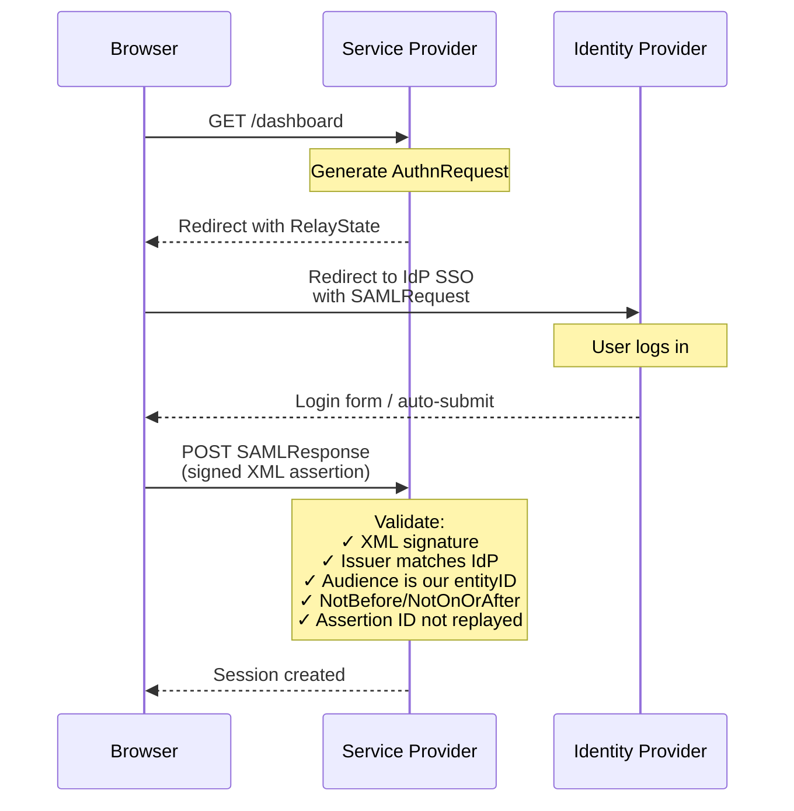

# 06 — SAML 2.0

SAML 2.0 (Security Assertion Markup Language) is an XML-based, enterprise-grade SSO protocol. It enables identity federation across organizations and domains using signed XML assertions.

## Core Concepts

| Actor | Description |
|-------|-------------|
| **Principal** | The user seeking access |
| **Identity Provider (IdP)** | Authenticates users, issues signed XML assertions |
| **Service Provider (SP)** | The application the user wants to access |

### SAML Assertion Structure

```
SAML Response (Signed)
└── Assertion (Signed)
    ├── Issuer
    ├── Subject
    │   ├── NameID (user@domain.com)
    │   └── SubjectConfirmation
    ├── Conditions
    │   ├── NotBefore / NotOnOrAfter
    │   ├── AudienceRestriction → SP Entity ID
    │   └── OneTimeUse
    └── AttributeStatement
        ├── email → user@example.com
        ├── role → admin
        └── department → engineering
```

### SAML SSO Flow (SP-Initiated)



```
Browser                    Service Provider              Identity Provider
  │                              │                              │
  │ GET /dashboard               │                              │
  │─────────────────────────────>│                              │
  │                              │  Generate AuthnRequest       │
  │                              │  Redirect with RelayState    │
  │<─────────────────────────────│                              │
  │                              │                              │
  │ Redirect to IdP SSO          │                              │
  │ with SAMLRequest             │                              │
  │───────────────────────────────────────────────────────────>│
  │                              │                              │
  │ (User logs in)               │                              │
  │<────────────────────────────────────────────────────────────│
  │                              │                              │
  │ POST SAMLResponse            │                              │
  │ (signed XML assertion)       │                              │
  │─────────────────────────────>│                              │
  │                              │                              │
  │ Validate:                    │                              │
  │  ✓ XML signature             │                              │
  │  ✓ Issuer matches IdP        │                              │
  │  ✓ Audience is our entityID  │                              │
  │  ✓ NotBefore/NotOnOrAfter    │                              │
  │  ✓ Assertion ID not replayed │                              │
  │                              │                              │
  │ Session created              │                              │
  │<─────────────────────────────│                              │
```

### Bindings

| Binding | Use |
|---------|-----|
| **HTTP-Redirect** | SP sends AuthnRequest via query params |
| **HTTP-POST** | IdP sends SAMLResponse via auto-submitted form |
| **HTTP-Artifact** | Large assertions via SOAP backend |

### SAML vs OIDC

| Aspect | SAML 2.0 | OIDC |
|--------|----------|------|
| Format | XML | JSON |
| Transport | POST/Redirect bindings | REST API |
| Tokens | Assertions | JWT (ID Token) |
| Complexity | High | Low |
| Mobile | Poor (ECP) | Native (PKCE) |
| Adoption | Enterprise, gov, edu | Modern web, mobile |

## Security

- **Always** validate XML signatures — never skip this
- Verify `Issuer` matches the expected IdP
- Check `AudienceRestriction` against your SP Entity ID
- Validate `NotBefore` / `NotOnOrAfter` (clock skew tolerance)
- Track `AssertionID` / `ID` to prevent replay attacks
- Watch for [XML signature wrapping attacks](https://www.usenix.org/legacy/events/sec08/tech/full_papers/somorovsky/somorovsky.pdf)

## Code Examples

| Language | IdP | SP | Notes |
|----------|-----|----|-------|
| [Python](python/) | FastAPI + signxml | Flask-like ACS | Full sign + verify |
| [TypeScript](typescript/) | Node.js HTTP + xml-crypto | Node.js ACS | Full sign + verify |
| [Go](go/) | net/http + goxmldsig | net/http ACS | Full sign + verify |

## References

- [SAML 2.0 Technical Overview](https://www.oasis-open.org/committees/download.php/27819/sstc-saml-tech-overview-2.0-cd-02.pdf)
- [SAML 2.0 Core](http://docs.oasis-open.org/security/saml/Post2.0/sstc-saml-core-2.0-os.pdf)
- [XML Signature](https://www.w3.org/TR/xmldsig-core/)
- [XML Exclusive Canonicalization](https://www.w3.org/TR/xml-exc-c14n/)
