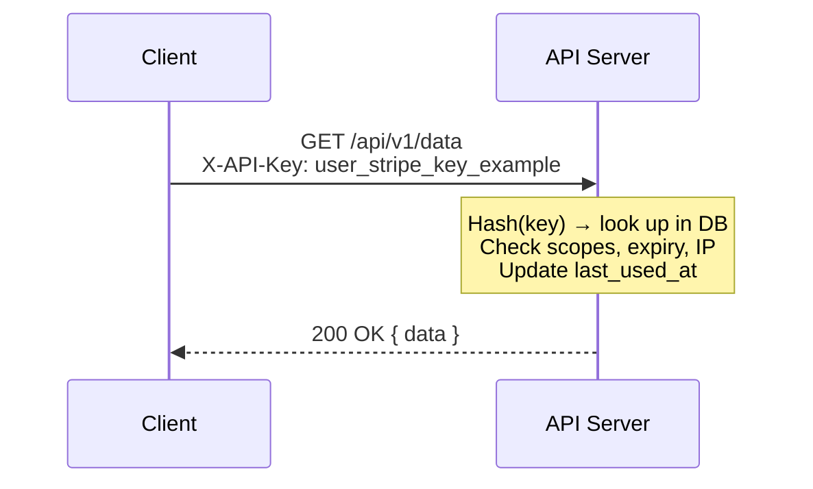

# 07 — API Key Authentication

API keys are the simplest form of service-to-service auth — a unique secret string sent on every request. Used by Stripe, GitHub, AWS, and virtually every public API.

## How It Works



```
Client                         API Server
  |                               |
  |  GET /api/v1/data             |
  |  X-API-Key: user_stripe_key_example   |
  |------------------------------->|
  |                               |
  |  Hash(key) → look up in DB   |
  |  Check scopes, expiry, IP    |
  |  Update last_used_at         |
  |                               |
  |  200 OK { data }              |
  |<-------------------------------|
```

## Key Format

```
user_stripe_key_example
├──┬──┴──────────────────────────────┬──┤
│  │                                 │  └─ last 4 chars (for UI display)
│  │                                 └──── 40 random chars (base62, 240 bits)
│  └────────────────────────────────────── environment label
└───────────────────────────────────────── example placeholder for a user-facing API key
```

## Key Storage (Database)

```
┌──────────────────────────────────────────────────┐
│                   api_keys                        │
├──────────────────────────────────────────────────┤
│ id          │ UUID                                │
│ name        │ "Production Key"                    │
│ prefix      │ "user_stripe_key"                  │
│ key_hash    │ SHA-256(key)                        │ ← NEVER raw key
│ key_suffix  │ "a3d"                               │ ← last 4 chars
│ scopes      │ ["read","write","admin"]            │
│ expires_at  │ 2027-01-01                          │
│ last_used   │ 2026-06-20                          │
│ created_at  │ 2026-01-01                          │
└──────────────────────────────────────────────────┘
```

## Transmission Methods

| Method | Header/Position | Security |
|--------|----------------|----------|
| Custom header | `X-API-Key: user_stripe_key_...` | ✅ Best — not in URL/body |
| Authorization | `Authorization: Bearer user_stripe_key_...` | ✅ Follows RFC 6750 |
| Query param | `?api_key=user_stripe_key_...` | ❌ Logged, cached, leaked |
| Request body | `{ "api_key": "user_stripe_key_..." }` | ⚠️ Only for POST |

## Security Checklist

- [ ] Hash keys with SHA-256 before storing (or bcrypt for slower hashing)
- [ ] Never return full key after creation — show prefix + last 4 chars
- [ ] Rate limit per key
- [ ] Support scopes, expiry, IP restrictions
- [ ] Provide key rotation endpoint (old → new)
- [ ] Allow instant revocation
- [ ] Audit log all key usage
- [ ] Use constant-time comparison when validating

## Code Examples

| Language | Server | Features |
|----------|--------|----------|
| [Python](python/) | FastAPI | Hash storage, scopes, expiry, rotation, rate limiting |
| [TypeScript](typescript/) | Node.js HTTP | SHA-256 hashing, scopes, expiry, rotation |
| [Go](go/) | net/http | SHA-256 hashing, scopes, expiry, rotation |

## References

- [Stripe API Key Best Practices](https://stripe.com/docs/keys)
- [GitHub API Key Auth](https://docs.github.com/en/rest/authentication)
- [AWS API Key Mgmt](https://docs.aws.amazon.com/apigateway/latest/developerguide/api-gateway-api-usage-plans.html)
