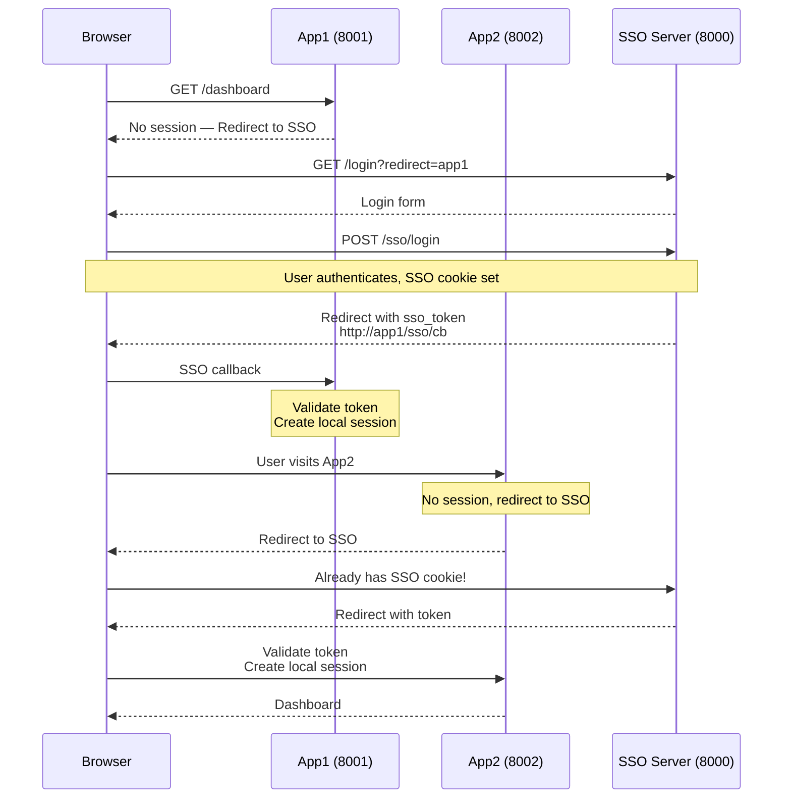

# 08 — Single Sign-On (SSO)

SSO lets users authenticate **once** and access **multiple applications** without re-entering credentials. It's the foundation of enterprise auth, Google Workspace, Microsoft 365, and every modern identity platform.

## SSO Architectures

### 1. Same-Domain (Cookie-Based)

```
                    auth.example.com (SSO Cookie)
                           │
            ┌──────────────┼──────────────┐
            │              │              │
         app1           app2           app3
        .example        .example       .example
```

Cookie shared across subdomains via `Domain=.example.com`. Simple, but limited to one parent domain.

### 2. Cross-Domain (Token Exchange)

```
                     ┌──────────────┐
                     │  Auth Server │
                     │  sso.example │
                     └──────┬───────┘
                            │
            ┌───────────────┼───────────────┐
            │  Login +      │               │
            │  redirect     │  Login +      │
            │  with token   │  redirect     │
            ▼               │  with token   ▼
        ┌──────┐            │            ┌──────┐
        │ App1 │◄───────────┘            │ App2 │
        │ .com │      Validate token     │ .org │
        └──────┘                         └──────┘
```

This is what we build here — a cross-domain SSO using JWT tokens.

## SSO Flow



```
Browser                 App1 (localhost:8001)       App2 (localhost:8002)     SSO Server (localhost:8000)
  │                          │                          │                          │
  │ GET /dashboard           │                          │                          │
  │─────────────────────────>│                          │                          │
  │                          │ No session               │                          │
  │<─── Redirect to SSO ─────│                          │                          │
  │                          │                          │                          │
  │ GET /login?redirect=app1 │                          │                          │
  │──────────────────────────────────────────────────────────────────────────────>│
  │                          │                          │                          │
  │ (User logs in)           │                          │                          │
  │<──────────────────────────────────────────────────────────────────────────────│
  │                          │                          │                          │
  │ POST /sso/login          │                          │                          │
  │──────────────────────────────────────────────────────────────────────────────>│
  │                          │                          │                          │
  │ Redirect with sso_token  │                          │                          │
  │<─── http://app1/sso/cb ──│──────────────────────────│──────────────────────────│
  │                          │                          │                          │
  │ App1 validates token,    │                          │                          │
  │ creates local session    │                          │                          │
  │                          │                          │                          │
  │ User now visits App2     │                          │                          │
  │────────────────────────────────────────────────────>│                          │
  │                          │                          │                          │
  │ No session, redirect to  │                          │                          │
  │ SSO — already has SSO    │                          │                          │
  │ cookie!                  │                          │                          │
  │<──── Redirect with token─│──────────────────────────│──────────────────────────│
  │                          │                          │                          │
  │ App2 validates token,    │                          │                          │
  │ creates local session    │                          │                          │
```

## Code Examples

| Language | SSO Server | App1 | App2 |
|----------|------------|------|------|
| [Python](python/) | FastAPI | FastAPI | FastAPI |
| [TypeScript](typescript/) | Node.js | Node.js | Node.js |
| [Go](go/) | net/http | net/http | net/http |

## References

- [NIST SP 800-63 — Digital Identity Guidelines](https://pages.nist.gov/800-63-3/)
- [OIDC SSO Patterns](https://auth0.com/docs/authenticate/single-sign-on)
