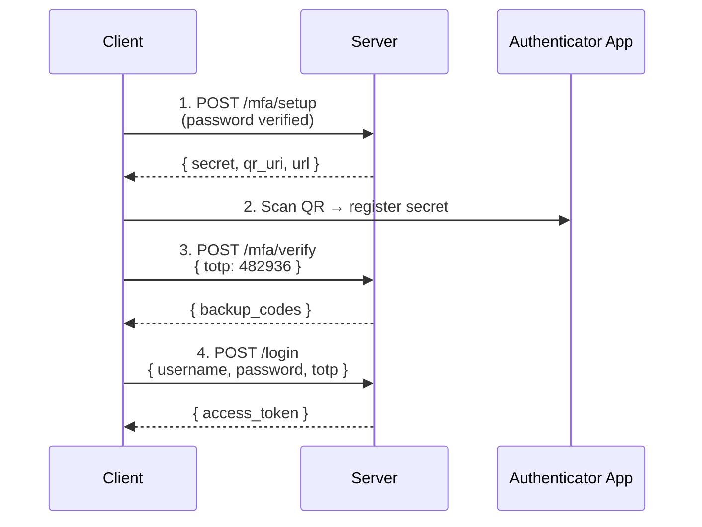

# 09 — Multi-Factor Authentication (MFA)

MFA requires **two or more** evidence factors. The single most effective control against credential theft.

## The Three Factors

```
KNOWLEDGE (you know)    POSSESSION (you have)    INHERENCE (you are)
    Password                Phone / TOTP App         Fingerprint
    PIN                     Hardware Token           Face ID
    Security Question       Security Key             Voice/Iris
```

## MFA Methods

| Method | Security | UX | Notes |
|--------|----------|----|-------|
| **TOTP** (this demo) | High | Good | Authenticator app, 30s window |
| SMS | Low | Good | ⚠️ SIM swap risk (NIST deprecated) |
| Push Notification | High | Great | Best UX |
| Hardware Token | Very High | Good | Phishing-resistant |
| WebAuthn/Passkeys | Very High | Great | Platform built-in |

## TOTP Flow



```
Client                               Server
  │                                     │
  │  1. POST /mfa/setup                 │
  │  (password verified)                │
  │  <── { secret, qr_uri, url }        │
  │                                     │
  │  2. Scan QR → Google Authenticator  │
  │                                     │
  │  3. POST /mfa/verify                │
  │  { totp: 482936 }                   │
  │  <── { backup_codes }               │
  │                                     │
  │  4. POST /login                     │
  │  { username, password, totp }       │
  │  <── { access_token }               │
```

## Code Examples

| Language | Server | Features |
|----------|--------|----------|
| [Python](python/) | FastAPI + pyotp | TOTP setup, verify, login with MFA, backup codes |
| [TypeScript](typescript/) | Node.js + otplib | TOTP setup, verify, login with MFA, backup codes |
| [Go](go/) | net/http + pquerna/otp | TOTP setup, verify, login with MFA, backup codes |

## References

- [RFC 6238 — TOTP](https://datatracker.ietf.org/doc/html/rfc6238)
- [RFC 4226 — HOTP](https://datatracker.ietf.org/doc/html/rfc4226)
- [NIST SP 800-63B](https://pages.nist.gov/800-63-3/sp800-63b.html)
