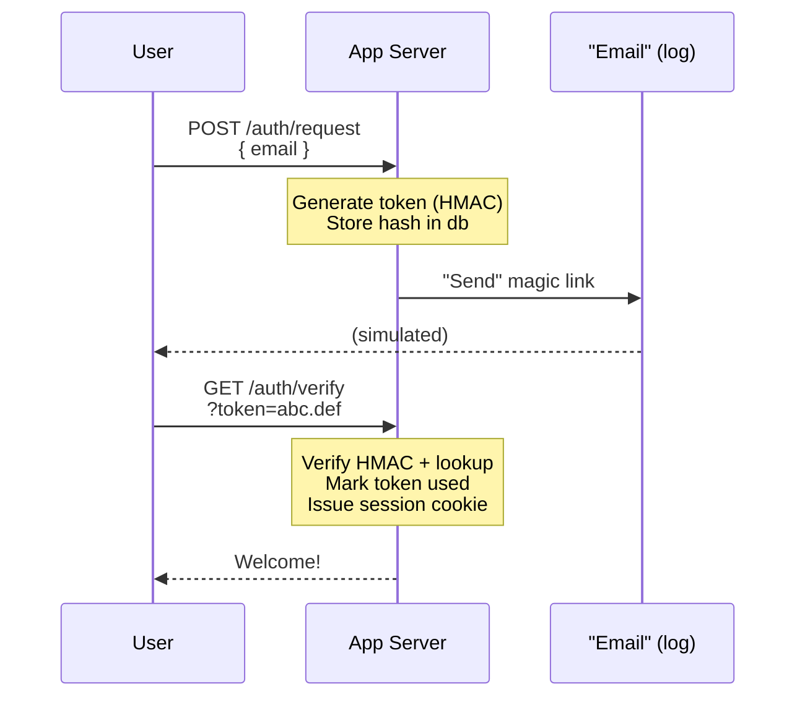

# 10 — Passwordless Authentication

Authenticate without passwords using **Magic Links**, **WebAuthn/Passkeys**, or **One-Time Passcodes**. Improves both security and UX.

## Flow (Magic Links)



```
User                    App Server               "Email" (log)
 │                         │                         │
 │  POST /auth/request     │                         │
 │  { email }              │                         │
 │────────────────────────>│                         │
 │                         │  Generate token (HMAC)  │
 │                         │  Store hash in db       │
 │                         │  "Send" magic link      │
 │                         │────────────────────────>│
 │                         │                         │
 │  GET /auth/verify       │                         │
 │  ?token=abc.def         │                         │
 │────────────────────────>│                         │
 │                         │  Verify HMAC + lookup   │
 │                         │  Mark token used        │
 │                         │  Issue session cookie   │
 │<────────────────────────│                         │
 │  Welcome!               │                         │
```

## Methods Compared

| Method | Security | UX | Best For |
|--------|----------|----|----------|
| **Magic Links** | High (if HMAC-signed) | Great | Email-first apps |
| **WebAuthn / Passkeys** | Very High | Excellent | High-security + native |
| **OTP (email/SMS)** | Medium | Good | Quick onboarding |

## Code Examples

| Language | Server | Features |
|----------|--------|----------|
| [Python](python/) | FastAPI | Magic link generate + verify, single-use tokens, HMAC signing |
| [TypeScript](typescript/) | Node.js | Magic link generate + verify, single-use tokens, HMAC signing |
| [Go](go/) | net/http | Magic link generate + verify, single-use tokens, HMAC signing |

## Security

- **Single-use tokens**: required (prevent replay)
- **Short expiry**: 15 minutes max
- **HMAC-signed**: prevents tampering with token payload
- **Constant-time comparison**: prevent timing attacks on token hash
- **Rate-limit**: by email/IP to prevent enumeration
- **Audit log**: record every auth attempt with timestamp + IP

## References

- [WebAuthn Level 2 (W3C)](https://www.w3.org/TR/webauthn-2/)
- [FIDO2 Overview](https://fidoalliance.org/fido2/)
- [Passkeys Overview (Apple)](https://developer.apple.com/passkeys/)
- [Magic Links — OWASP Cheat Sheet](https://cheatsheetseries.owasp.org/cheatsheets/Passwordless_Authentication.html)
