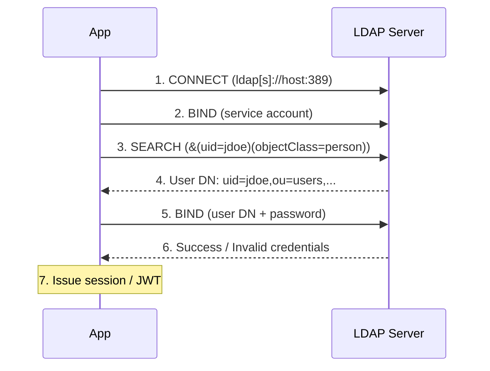

# 11 — LDAP / Active Directory

Authenticate users against an LDAP directory (OpenLDAP, Active Directory, etc.) using the **BIND** operation.

## Flow



```
App                                 LDAP Server
 │                                       │
 │  1. CONNECT  (ldap[s]://host:389)    │
 │──────────────────────────────────────>│
 │                                       │
 │  2. BIND (service account)            │
 │──────────────────────────────────────>│
 │                                       │
 │  3. SEARCH (&(uid=jdoe)(objectClass=person))
 │──────────────────────────────────────>│
 │                                       │
 │  4. ← User DN: uid=jdoe,ou=users,... │
 │                                       │
 │  5. BIND (user DN + password)         │
 │──────────────────────────────────────>│
 │                                       │
 │  6. ← Success / Invalid credentials   │
 │                                       │
 │  7. Issue session / JWT               │
 │<──────────────────────────────────────│
```

## Directory Structure

```
dc=example,dc=com
├── ou=users
│   ├── uid=newton      (cn=Isaac Newton)
│   ├── uid=galileo     (cn=Galileo Galilei)
│   └── uid=einstein    (cn=Albert Einstein)
├── ou=groups
│   ├── cn=scientists
│   └── cn=admins
└── ou=devices
    └── cn=server-01
```

## Operations

| Op | Description |
|----|-------------|
| **BIND** | Authenticate (the core auth mechanism) |
| **SEARCH** | Find user entries by filter |
| **COMPARE** | Check attribute membership |
| **ADD / MODIFY / DELETE** | Directory management |

## Code Examples

| Language | Server | Features |
|----------|--------|----------|
| [Python](python/) | FastAPI + ldap3 | Login via LDAP BIND, user search, attribute query |
| [TypeScript](typescript/) | Node.js + ldapjs | Login via LDAP BIND, user search, attribute query |
| [Go](go/) | net/http + ldap/v3 | Login via LDAP BIND, user search, attribute query |

## Quick Start (Docker OpenLDAP)

```bash
docker run --name openldap -p 389:389 -p 636:636 \
  -e LDAP_ORGANISATION="Auth Series" \
  -e LDAP_DOMAIN="example.com" \
  -e LDAP_ADMIN_PASSWORD="admin" \
  -d osixia/openldap:latest
```

Or use the public test server: `ldap://ldap.forumsys.com:389` (read-only).

## Security

- **Always use LDAPS** (port 636) or STARTTLS in production
- Use a **service account** with minimal search scope — never `cn=Manager,dc=example,dc=com`
- **Escape LDAP filters** to prevent LDAP injection
- **Connection pool** with timeouts — LDAP BIND is synchronous and slow
- **Account lockout**: track failed BIND attempts server-side
- Never log user DNs or credentials

## References

- [RFC 4511 — LDAP: Protocol](https://datatracker.ietf.org/doc/html/rfc4511)
- [RFC 4513 — LDAP: Authentication Methods](https://datatracker.ietf.org/doc/html/rfc4513)
- [OWASP LDAP Injection Prevention](https://cheatsheetseries.owasp.org/cheatsheets/LDAP_Injection_Prevention_Cheat_Sheet.html)
