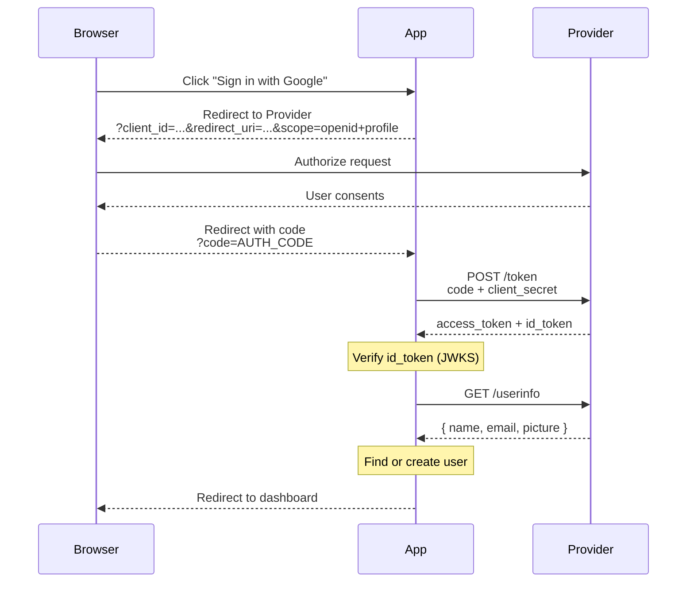

# 12 — Social Login

Let users sign in with Google, GitHub, Apple, etc. Built on **OAuth 2.0 Authorization Code flow** + **OpenID Connect**.

## Flow



```
Browser                     App                         Provider
  │                         │                             │
  │  Click "Sign in with Google"                          │
  │────────────────────────>│                             │
  │                         │                             │
  │  Redirect to Provider   │                             │
  │  ?client_id=...         │                             │
  │  &redirect_uri=...      │                             │
  │  &scope=openid+profile  │                             │
  │<────────────────────────│                             │
  │                         │                             │
  │──────────────────────────────────────────────────────>│
  │                         │                             │
  │  (User consents)        │                             │
  │<──────────────────────────────────────────────────────│
  │                         │                             │
  │  Code in redirect       │                             │
  │  ?code=AUTH_CODE        │                             │
  │────────────────────────>│                             │
  │                         │                             │
  │                         │  POST /token                │
  │                         │  code + client_secret       │
  │                         │────────────────────────────>│
  │                         │                             │
  │                         │  ← access_token + id_token  │
  │                         │                             │
  │                         │  Verify id_token (JWKS)     │
  │                         │  GET /userinfo              │
  │                         │────────────────────────────>│
  │                         │                             │
  │                         │  ← { name, email, picture } │
  │                         │                             │
  │                         │  Find or create user        │
  │                         │                             │
  │  Redirect to dashboard  │                             │
  │<────────────────────────│                             │
```

## Code Examples

| Language | Server | Features |
|----------|--------|----------|
| [Python](python/) | FastAPI | Mock Google + GitHub providers, full OAuth flow with consent, session |
| [TypeScript](typescript/) | Node.js | Mock Google + GitHub providers, full OAuth flow with consent, session |
| [Go](go/) | net/http | Mock Google + GitHub providers, full OAuth flow with consent, session |

This demo includes a **built-in mock provider** — no external API keys needed.

## Security

- **Verify the ID Token** — check `iss`, `aud`, `exp`, and signature using provider's JWKS
- **Use PKCE** for mobile/native apps
- **Never trust the access token** for identity — always verify the ID Token
- **Normalize emails** before account linking
- **Store provider + providerId** as a unique compound key
- **Allow unlinking** — users should control which social accounts are connected
- **Handle email changes** — providers may update the user's email

## References

- [Google Sign-In](https://developers.google.com/identity/sign-in/web)
- [GitHub OAuth Apps](https://docs.github.com/en/developers/apps/building-oauth-apps)
- [Sign in with Apple](https://developer.apple.com/sign-in-with-apple/)
- [Facebook Login](https://developers.facebook.com/docs/facebook-login/)
