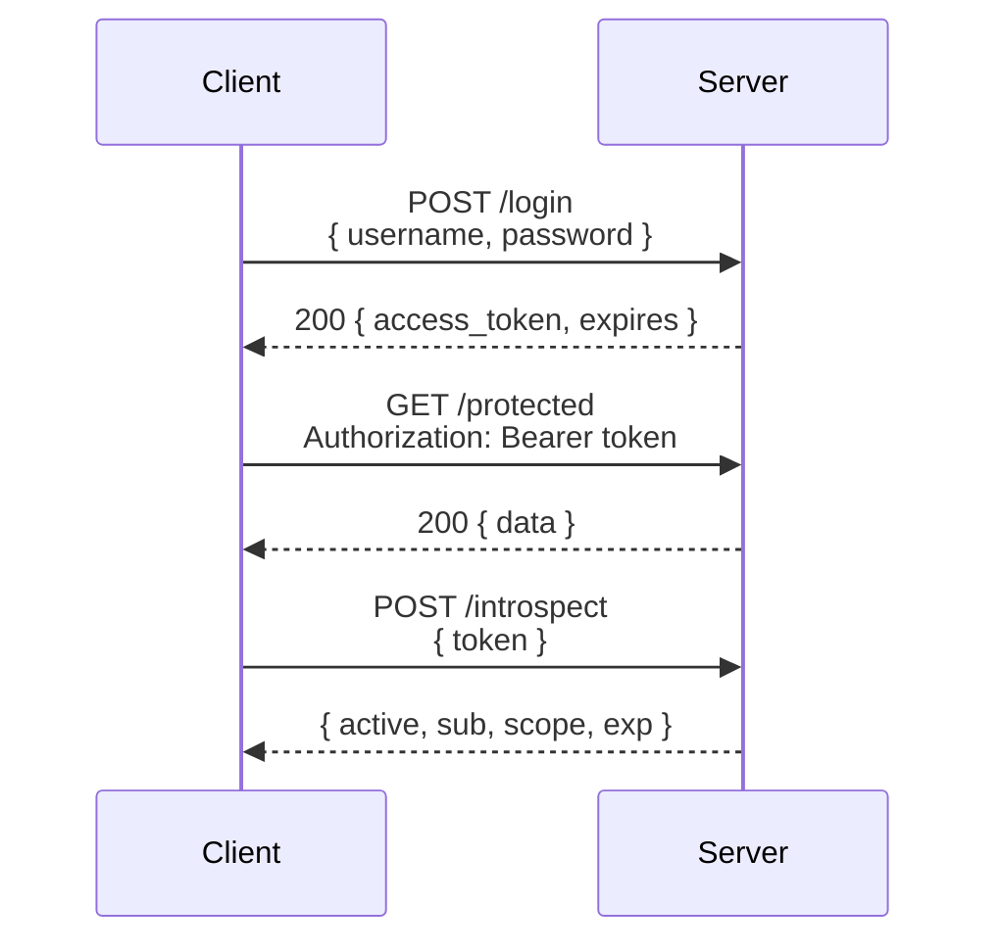

# 13 — Bearer Token Authentication

Authenticate via `Authorization: Bearer <token>`. The token itself is the credential — anyone who possesses it can access protected resources.

## Flow



```
Client                              Server
  │                                   │
  │  POST /login                      │
  │  { username, password }           │
  │──────────────────────────────────>│
  │                                   │
  │  ← 200 { access_token, expires } │
  │                                   │
  │  GET /protected                   │
  │  Authorization: Bearer <token>    │
  │──────────────────────────────────>│
  │                                   │
  │  ← 200 { data }                   │
  │                                   │
  │  POST /introspect                 │
  │  { token }                        │
  │──────────────────────────────────>│
  │                                   │
  │  ← { active, sub, scope, exp }   │
```

## Token Types

| Type | Storage | Verify | Revoke | Use Case |
|------|---------|--------|--------|----------|
| **Opaque** (this demo) | DB (hashed) | DB lookup | ✅ | Revocable, session-like |
| **JWT** | Self-contained | Signature | ❌ | Stateless, distributed |

## Code Examples

| Language | Server | Features |
|----------|--------|----------|
| [Python](python/) | FastAPI | Token issue, validate, introspect, revoke, scope check |
| [TypeScript](typescript/) | Node.js | Token issue, validate, introspect, revoke, scope check |
| [Go](go/) | net/http | Token issue, validate, introspect, revoke, scope check |

## Security

- **Store only hashed tokens** (SHA-256) — never the raw token
- Token is a high-entropy random string (48 bytes → 64-char Base64URL)
- Support **revocation** — critical for security incidents
- **Short lifetimes** — minutes to hours, not days
- Always use **HTTPS** — tokens are sent in plaintext headers
- Never log tokens or include them in URLs
- Implement **rate limiting** on token endpoints
- Consider **token binding** (DPoP) for high-security scenarios

## References

- [RFC 6750 — Bearer Token Usage](https://datatracker.ietf.org/doc/html/rfc6750)
- [RFC 7662 — Token Introspection](https://datatracker.ietf.org/doc/html/rfc7662)
- [RFC 7009 — Token Revocation](https://datatracker.ietf.org/doc/html/rfc7009)
