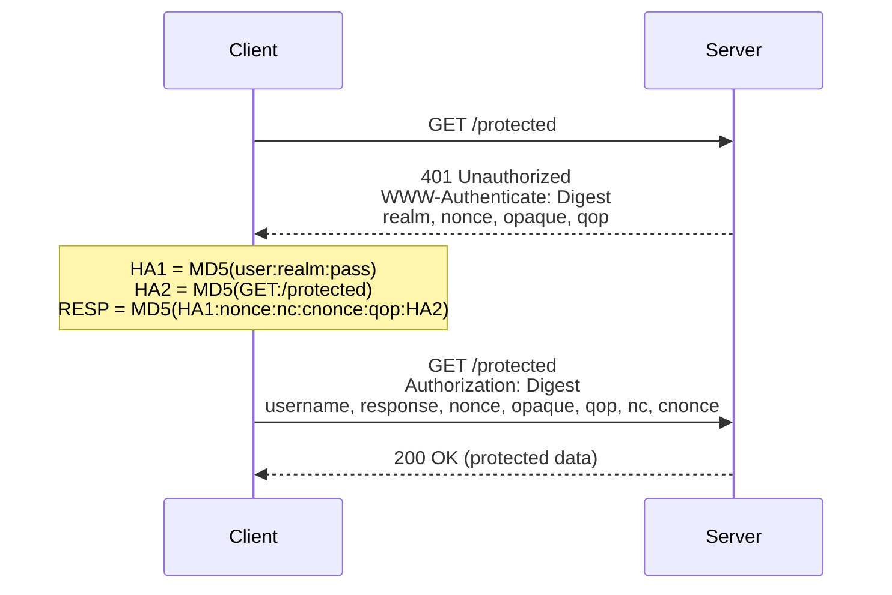

# 14 — Digest Access Authentication

Challenge-response protocol that avoids sending passwords in plaintext. Uses MD5 hashing. Largely replaced by HTTPS + JWT/sessions, but still found in legacy and IoT systems.

## Flow



```
Client                          Server
  │                                │
  │  GET /protected                │
  │───────────────────────────────>│
  │                                │
  │  401 Unauthorized              │
  │  WWW-Authenticate: Digest      │
  │    realm="Auth Series",        │
  │    nonce="dcd98b7102..."       │
  │    opaque="5ccc069c..."        │
  │    qop="auth"                  │
  │<───────────────────────────────│
  │                                │
  │  HA1 = MD5(user:realm:pass)    │
  │  HA2 = MD5(GET:/protected)     │
  │  RES = MD5(HA1:nonce:nc:      │
  │            cnonce:qop:HA2)     │
  │                                │
  │  GET /protected                │
  │  Authorization: Digest         │
  │    username="alice",           │
  │    response="6629fae4...",     │
  │    nonce="dcd98b7102...",      │
  │    opaque="5ccc069c..."        │
  │    qop=auth, nc=00000001,      │
  │    cnonce="0a4f113b..."        │
  │───────────────────────────────>│
  │                                │
  │  ← 200 OK (protected data)     │
```

## Response Calculation

```
HA1  = MD5("username:realm:password")
HA2  = MD5("HTTP_METHOD:uri_path")
RESP = MD5("HA1:nonce:nc:cnonce:qop:HA2")
```

## Code Examples

| Language | Server | Features |
|----------|--------|----------|
| [Python](python/) | HTTP.server | Digest challenge, nonce validation, counter-based replay protection |
| [TypeScript](typescript/) | Node.js | Digest challenge, nonce validation, counter-based replay protection |
| [Go](go/) | net/http | Digest challenge, nonce validation, counter-based replay protection |

## Security Notes

- **NOT a replacement for HTTPS** — still vulnerable to MITM
- MD5 is **cryptographically broken** — do not use for new systems
- Nonces must be **unpredictable** and **single-use** for real replay protection
- Storing `HA1` (MD5 of user:realm:pass) is equivalent to storing plaintext
- **Deprecated** — prefer JWT, session cookies, or Bearer tokens

## References

- [RFC 7616 — HTTP Digest Access Authentication](https://datatracker.ietf.org/doc/html/rfc7616)
- [RFC 2617 — Original Digest Auth](https://datatracker.ietf.org/doc/html/rfc2617)
