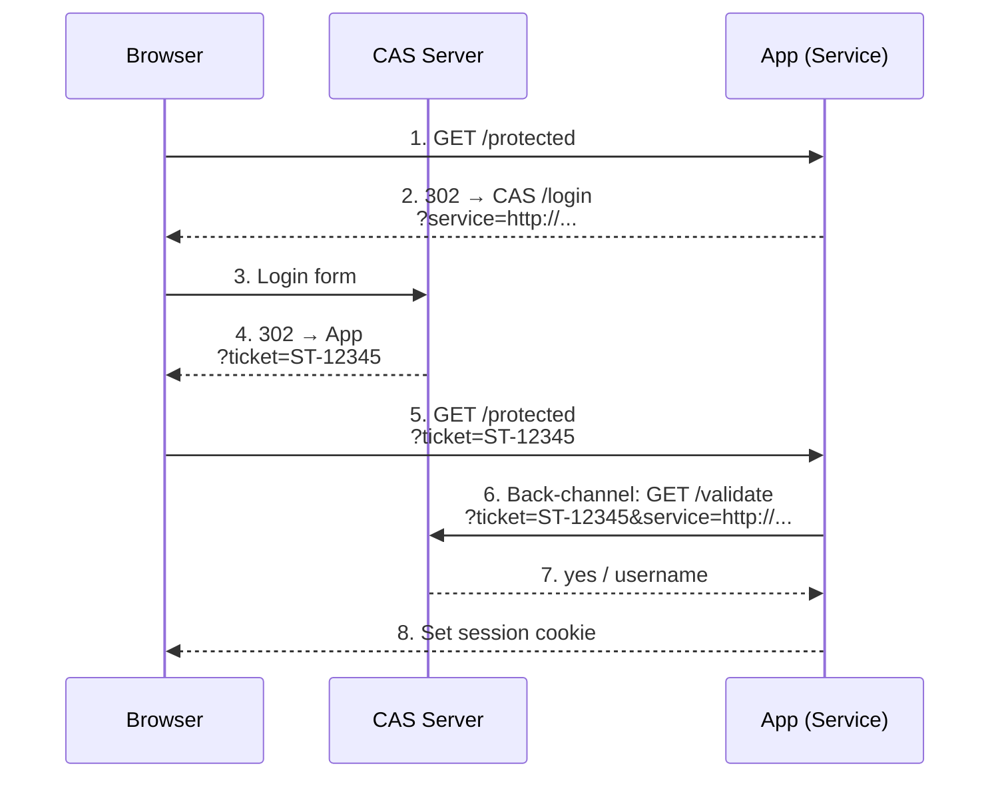

# 15 — CAS (Central Authentication Service)

Single sign-on protocol originally developed at Yale. Still widely used in academic and enterprise Java environments.

## Flow



```
Browser                CAS Server              App (Service)
  │                        │                       │
  │  1. GET /protected     │                       │
  │────────────────────────────────────────────────>│
  │                        │                       │
  │  2. 302 → CAS /login   │                       │
  │  ?service=http://...   │                       │
  │<────────────────────────────────────────────────│
  │                        │                       │
  │  3. Login form         │                       │
  │───────────────────────>│                       │
  │                        │                       │
  │  4. 302 → App          │                       │
  │  ?ticket=ST-12345      │                       │
  │<───────────────────────│                       │
  │                        │                       │
  │  5. GET /protected     │                       │
  │  ?ticket=ST-12345      │                       │
  │────────────────────────────────────────────────>│
  │                        │                       │
  │  6. Back-channel:      │                       │
  │  GET /validate         │                       │
  │  ?ticket=ST-12345      │                       │
  │  &service=http://...   │                       │
  │───────────────────────>│                       │
  │                        │                       │
  │  7. ← yes / username   │                       │
  │<───────────────────────│                       │
  │                        │                       │
  │  8. Set session cookie │                       │
  │<────────────────────────────────────────────────│
```

## Code Examples

| Language | Server | Features |
|----------|--------|----------|
| [Python](python/) | FastAPI | CAS server + protected app, ticket validation, session |
| [TypeScript](typescript/) | Node.js | CAS server + protected app, ticket validation, session |
| [Go](go/) | net/http | CAS server + protected app, ticket validation, session |

This demo bundles the **CAS server** and a **protected app** in one server for self-contained testing.

## CAS Protocol Versions

| Version | Features |
|---------|----------|
| **CAS 1.0** (this demo) | `/login`, `/validate` (plaintext response) |
| **CAS 2.0** | `/serviceValidate` (XML), proxy support |
| **CAS 3.0** | SAML attribute response, OpenID integration |

## Security

- Tickets are **single-use** and **time-limited** (5 minutes)
- Service URL is validated on ticket issuance
- Back-channel validation prevents man-in-the-middle ticket stealing
- Always use **HTTPS** in production (ticket is in URL query param)
- Implement **session timeout** on the service side

## References

- [CAS Protocol Specification](https://apereo.github.io/cas/6.6.x/protocol/CAS-Protocol.html)
- [Apereo CAS](https://github.com/apereo/cas) — Reference implementation
- [CAS in the Cloud — OWASP](https://cheatsheetseries.owasp.org/cheatsheets/CAS_Cheat_Sheet.html)
