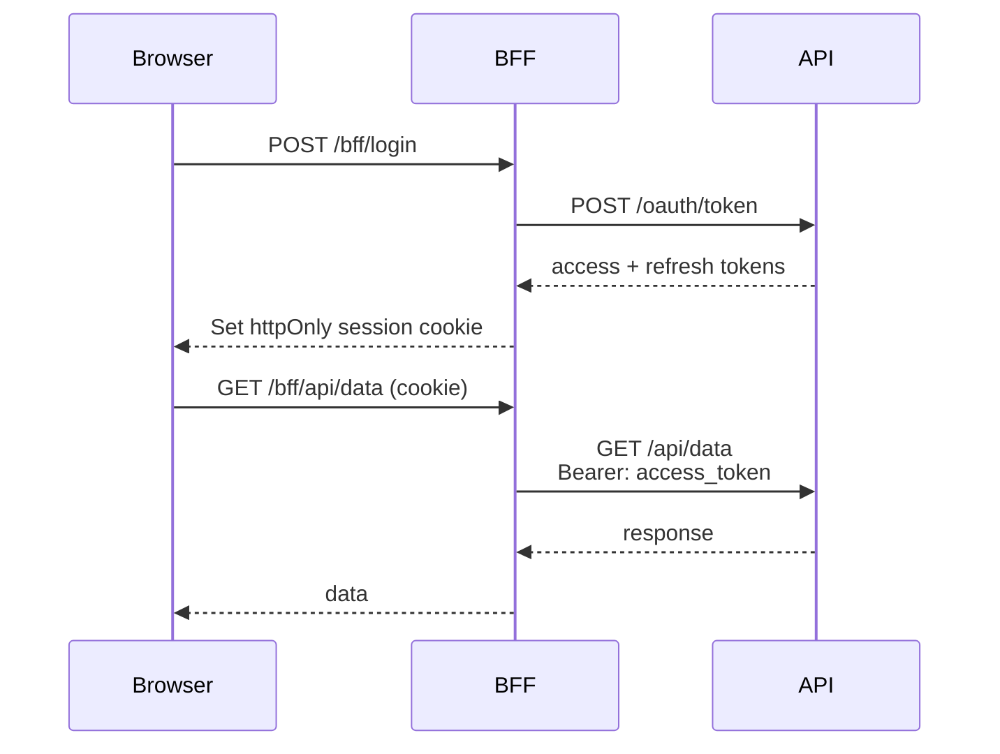
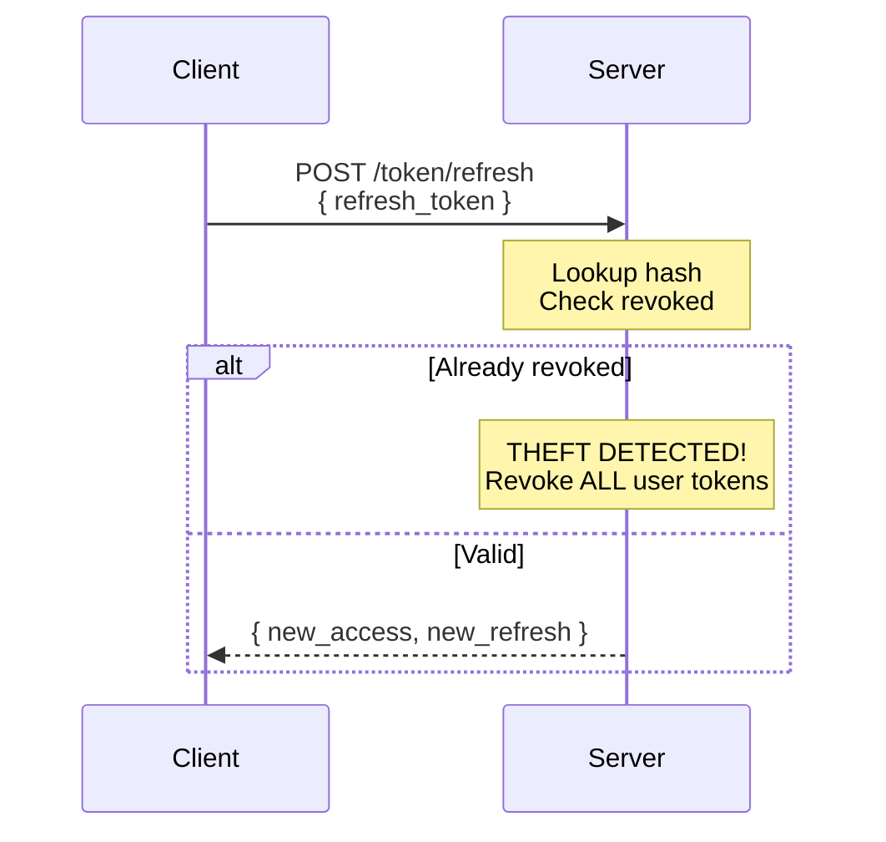
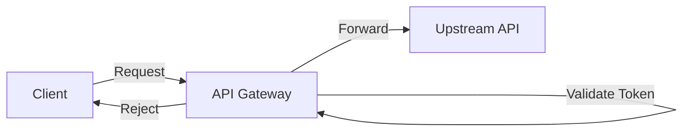

# 16 — Auth Patterns & Architecture

Architectural decisions and design patterns for authentication in modern applications — monoliths, microservices, SPAs, and APIs.

## Patterns Covered

| # | Pattern | Code |
|---|---------|------|
| 1 | **BFF (Backend for Frontend)** | Token management in server, not browser |
| 2 | **Token Rotation** | Refresh token rotation with theft detection |
| 3 | **API Gateway Auth** | Centralized token validation middleware |

## 1. BFF (Backend for Frontend)



```
Browser                          BFF                         API
  │                               │                          │
  │  POST /bff/login              │                          │
  │──────────────────────────────>│                          │
  │                               │  POST /oauth/token       │
  │                               │─────────────────────────>│
  │                               │  ← access + refresh      │
  │                               │                          │
  │  Set httpOnly session cookie  │                          │
  │<──────────────────────────────│                          │
  │                               │                          │
  │  GET /bff/api/data            │                          │
  │  (cookie)                     │                          │
  │──────────────────────────────>│                          │
  │                               │  GET /api/data           │
  │                               │  Bearer: access_token    │
  │                               │─────────────────────────>│
```

## 2. Token Rotation



```
Client                          Server
  │                               │
  │  POST /token/refresh          │
  │  { refresh_token }            │
  │──────────────────────────────>│
  │                               │
  │  ── Lookup hash ──            │
  │  ── Check revoked ──          │
  │                               │
  │  IF already revoked ── theft! │
  │  → Revoke ALL user tokens     │
  │                               │
  │  ← { new_access,              │
  │      new_refresh }            │
```

## 3. API Gateway Auth



```
Client → Gateway → Validate Token → Forward / Reject → Upstream API
```

## Code Examples

| Language | Features |
|----------|----------|
| [Python](python/) | BFF proxy, token rotation with theft detection, gateway middleware |
| [TypeScript](typescript/) | BFF proxy, token rotation with theft detection, gateway middleware |
| [Go](go/) | BFF proxy, token rotation with theft detection, gateway middleware |

## References

- [BFF Pattern (Auth0)](https://auth0.com/blog/the-backend-for-frontend-pattern-bff/)
- [OAuth 2.0 for Browser-Based Apps](https://datatracker.ietf.org/doc/html/draft-ietf-oauth-browser-based-apps)
- [Refresh Token Rotation (RFC 6819)](https://datatracker.ietf.org/doc/html/rfc6819#section-5.2.2.3)
