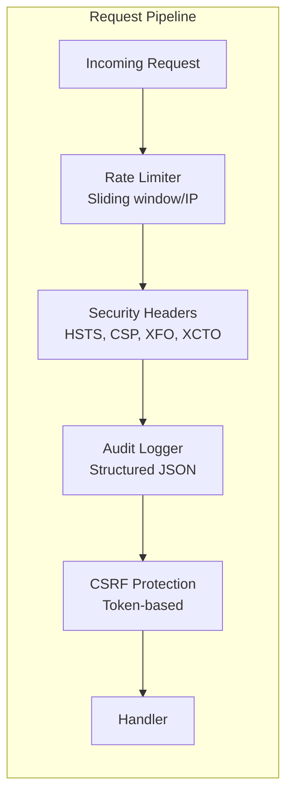

# 17 — Security Best Practices

Non-negotiable security practices for every auth system — rate limiting, audit logging, CSRF protection, and secure headers.

## Code Examples

| Language | Features |
|----------|----------|
| [Python](python/) | Rate limiter, security headers middleware, audit logger, CSRF |
| [TypeScript](typescript/) | Rate limiter, security headers middleware, audit logger, CSRF |
| [Go](go/) | Rate limiter, security headers middleware, audit logger, CSRF |

## Implementations

| Component | Description |
|-----------|-------------|
| **Rate Limiter** | Sliding window by IP, configurable limits |
| **Security Headers** | HSTS, CSP, X-Frame-Options, X-Content-Type-Options |
| **Audit Logger** | Structured JSON logging of auth events |
| **CSRF Protection** | Token-based CSRF for state-changing requests |



## Quick Reference

```
Hashing:     bcrypt / argon2id (NOT MD5, SHA-1, SHA-256)
Cookies:     HttpOnly + Secure + SameSite=Strict
JWT:         Short TTL (15m) + RS256/ES256 + validate iss/aud/exp
Rate Limit:  5/min on login, 100/min on general API
Logging:     Structured JSON, never log tokens/passwords
Transport:   TLS 1.2+ only (disable TLS 1.0/1.1, SSLv3)
```

## References

- [OWASP Authentication Cheat Sheet](https://cheatsheetseries.owasp.org/cheatsheets/Authentication_Cheat_Sheet.html)
- [NIST SP 800-63B](https://pages.nist.gov/800-63-3/sp800-63b.html)
- [OWASP Top 10 — 2021](https://owasp.org/Top10/)
- [OWASP ASVS](https://owasp.org/www-project-application-security-verification-standard/)
